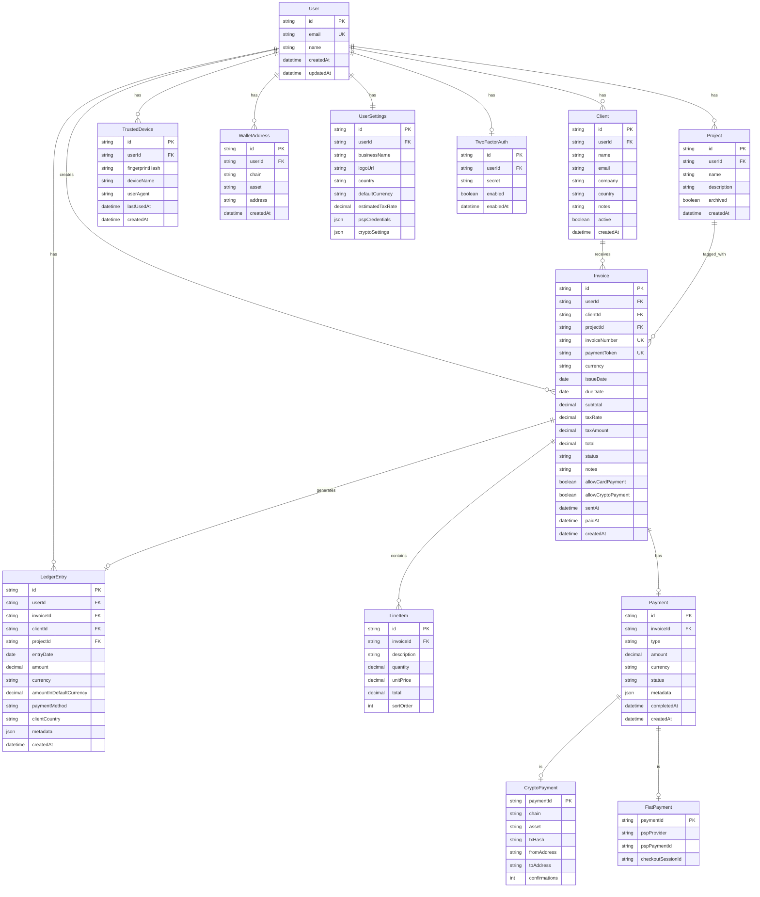

# 设计文档

## 概述

WorkWork Ledger MVP 是一个面向自由职业者的轻量级收入管理系统，核心功能包括：
- 用户认证（Magic Link + 设备指纹 + 2FA）
- 客户与项目管理
- 发票创建与管理
- 多渠道收款（PSP 法币 + 多链稳定币）
- 收入账本与仪表盘

### 技术栈选型

| 层级 | 技术选择 | 理由 |
|------|----------|------|
| 前端 | Next.js 14 (App Router) + TypeScript | SSR/SSG 支持、API Routes 内置、React 生态 |
| UI | Tailwind CSS + shadcn/ui | 快速开发、一致性设计、无需复杂 CSS |
| 后端 | Next.js API Routes + tRPC | 类型安全、减少样板代码、前后端一体 |
| 数据库 | PostgreSQL + Prisma ORM | 关系型数据、类型安全、迁移管理 |
| 认证 | NextAuth.js + 自定义 Magic Link | 成熟方案、支持多种 Provider |
| 缓存 | Redis (Upstash) | Session 存储、设备指纹缓存、限流 |
| 文件存储 | Cloudflare R2 / AWS S3 | Logo 上传、PDF 存储 |
| 支付 PSP | Stripe (主) / Airwallex (备) | 全球覆盖、API 成熟、Webhook 可靠 |
| 链上集成 | Alchemy SDK + Webhooks | 多链支持、地址监听、交易查询 |
| 部署 | Vercel + PlanetScale/Supabase | 零配置部署、自动扩展 |
| 测试 | Vitest + fast-check | 单元测试 + 属性测试 |

---

## 架构

### 系统架构图


### 分层架构

```
┌─────────────────────────────────────────────────────────┐
│                    Presentation Layer                    │
│  (Next.js Pages, React Components, tRPC Client)         │
├─────────────────────────────────────────────────────────┤
│                    Application Layer                     │
│  (tRPC Routers, API Handlers, Business Logic)           │
├─────────────────────────────────────────────────────────┤
│                     Domain Layer                         │
│  (Entities, Value Objects, Domain Services)             │
├─────────────────────────────────────────────────────────┤
│                  Infrastructure Layer                    │
│  (Prisma, Redis, PSP SDK, Alchemy SDK, Email)           │
└─────────────────────────────────────────────────────────┘
```

---

## 组件与接口

### 1. 认证模块 (Auth Service)

```typescript
interface AuthService {
  // Magic Link
  sendMagicLink(email: string): Promise<void>;
  verifyMagicLink(token: string, deviceFingerprint: string): Promise<Session>;
  
  // 设备管理
  recordDevice(userId: string, fingerprint: DeviceFingerprint): Promise<TrustedDevice>;
  getTrustedDevices(userId: string): Promise<TrustedDevice[]>;
  removeDevice(userId: string, deviceId: string): Promise<void>;
  isDeviceTrusted(userId: string, fingerprint: string): Promise<boolean>;
  
  // 2FA
  enable2FA(userId: string): Promise<{ secret: string; qrCode: string }>;
  verify2FA(userId: string, code: string): Promise<boolean>;
  disable2FA(userId: string, code: string): Promise<void>;
}

interface DeviceFingerprint {
  hash: string;
  userAgent: string;
  platform: string;
  timezone: string;
  language: string;
}

interface TrustedDevice {
  id: string;
  fingerprint: string;
  name: string;
  lastUsed: Date;
  createdAt: Date;
}
```

### 2. 支付网关抽象层 (Payment Gateway)

```typescript
interface PaymentGateway {
  // PSP 操作
  createCheckoutSession(params: CheckoutParams): Promise<CheckoutSession>;
  verifyWebhook(payload: string, signature: string): Promise<WebhookEvent>;
  getPaymentStatus(paymentId: string): Promise<PaymentStatus>;
  
  // 凭证管理
  validateCredentials(credentials: PSPCredentials): Promise<boolean>;
}

interface CheckoutParams {
  invoiceId: string;
  amount: Decimal;
  currency: Currency;
  customerEmail: string;
  successUrl: string;
  cancelUrl: string;
  metadata: Record<string, string>;
}

interface CheckoutSession {
  id: string;
  url: string;
  expiresAt: Date;
}

type PaymentStatus = 'pending' | 'processing' | 'succeeded' | 'failed' | 'cancelled';
```

### 3. 链抽象层 (Chain Abstraction Layer)

```typescript
interface ChainAbstractionLayer {
  // 地址管理
  generateAddress(userId: string, chain: Chain): Promise<WalletAddress>;
  getAddresses(userId: string): Promise<WalletAddress[]>;
  
  // 交易监听
  subscribeToAddress(address: string, chain: Chain): Promise<void>;
  unsubscribeFromAddress(address: string, chain: Chain): Promise<void>;
  
  // 交易验证
  verifyTransaction(txHash: string, chain: Chain): Promise<TransactionDetails>;
  getConfirmations(txHash: string, chain: Chain): Promise<number>;
}

type Chain = 'arbitrum' | 'base' | 'polygon';
type StablecoinAsset = 'USDC' | 'USDT';

interface WalletAddress {
  address: string;
  chain: Chain;
  asset: StablecoinAsset;
  createdAt: Date;
}

interface TransactionDetails {
  hash: string;
  chain: Chain;
  from: string;
  to: string;
  asset: StablecoinAsset;
  amount: Decimal;
  confirmations: number;
  timestamp: Date;
  status: 'pending' | 'confirmed' | 'failed';
}
```

### 4. 发票服务 (Invoice Service)

```typescript
interface InvoiceService {
  create(data: CreateInvoiceInput): Promise<Invoice>;
  update(id: string, data: UpdateInvoiceInput): Promise<Invoice>;
  delete(id: string): Promise<void>;
  
  getById(id: string): Promise<Invoice | null>;
  getByPaymentToken(token: string): Promise<Invoice | null>;
  list(userId: string, filters: InvoiceFilters): Promise<PaginatedResult<Invoice>>;
  
  send(id: string): Promise<{ paymentLink: string }>;
  markAsPaid(id: string, paymentDetails: PaymentDetails): Promise<Invoice>;
  cancel(id: string): Promise<Invoice>;
  
  exportPDF(id: string): Promise<Buffer>;
  
  // 状态自动更新
  checkOverdueInvoices(): Promise<void>;
}

interface CreateInvoiceInput {
  clientId: string;
  projectId?: string;
  currency: Currency;
  issueDate: Date;
  dueDate: Date;
  lineItems: LineItemInput[];
  taxRate?: Decimal;
  notes?: string;
  allowCardPayment: boolean;
  allowCryptoPayment: boolean;
}

interface LineItemInput {
  description: string;
  quantity: Decimal;
  unitPrice: Decimal;
}
```

### 5. 账本服务 (Ledger Service)

```typescript
interface LedgerService {
  createEntry(data: CreateLedgerEntryInput): Promise<LedgerEntry>;
  
  list(userId: string, filters: LedgerFilters): Promise<PaginatedResult<LedgerEntry>>;
  
  getStats(userId: string, period: TimePeriod): Promise<LedgerStats>;
  
  exportCSV(userId: string, filters: LedgerFilters): Promise<Buffer>;
}

interface LedgerFilters {
  startDate?: Date;
  endDate?: Date;
  clientId?: string;
  projectId?: string;
  currency?: Currency;
  paymentMethod?: PaymentMethod;
}

interface LedgerStats {
  totalIncome: Decimal;
  totalIncomeInDefaultCurrency: Decimal;
  byClient: { clientId: string; clientName: string; amount: Decimal; percentage: number }[];
  byPaymentMethod: { method: PaymentMethod; amount: Decimal; percentage: number }[];
  byPeriod: { period: string; amount: Decimal }[];
  suggestedTaxReserve?: Decimal;
}
```

---

## 数据模型

### ER 图



### 核心实体定义

```typescript
// 货币类型
type Currency = 'USD' | 'EUR' | 'CNY' | 'GBP' | 'JPY';
type PaymentMethod = 'card' | 'bank_transfer' | 'crypto_usdc' | 'crypto_usdt';

// 发票状态
type InvoiceStatus = 'draft' | 'sent' | 'paid' | 'overdue' | 'cancelled';

// 金额使用 Decimal.js 处理精度
interface Money {
  amount: Decimal;
  currency: Currency;
}

// 发票实体
interface Invoice {
  id: string;
  userId: string;
  clientId: string;
  projectId?: string;
  invoiceNumber: string;
  paymentToken: string;
  currency: Currency;
  issueDate: Date;
  dueDate: Date;
  lineItems: LineItem[];
  subtotal: Decimal;
  taxRate: Decimal;
  taxAmount: Decimal;
  total: Decimal;
  status: InvoiceStatus;
  notes?: string;
  allowCardPayment: boolean;
  allowCryptoPayment: boolean;
  sentAt?: Date;
  paidAt?: Date;
  createdAt: Date;
  updatedAt: Date;
}

// 明细项
interface LineItem {
  id: string;
  invoiceId: string;
  description: string;
  quantity: Decimal;
  unitPrice: Decimal;
  total: Decimal;
  sortOrder: number;
}

// 账本条目
interface LedgerEntry {
  id: string;
  userId: string;
  invoiceId: string;
  clientId: string;
  projectId?: string;
  entryDate: Date;
  amount: Decimal;
  currency: Currency;
  amountInDefaultCurrency: Decimal;
  paymentMethod: PaymentMethod;
  clientCountry: string;
  metadata: Record<string, unknown>;
  createdAt: Date;
}
```


---

## 正确性属性

*属性是指在系统所有有效执行中都应保持为真的特征或行为——本质上是关于系统应该做什么的形式化陈述。属性是人类可读规范与机器可验证正确性保证之间的桥梁。*

基于需求文档的验收标准，以下是需要通过属性测试验证的核心正确性属性：

### 认证与安全

**属性 1: Magic Link 过期验证**
*对于任意* Magic Link token，如果创建时间超过 15 分钟，验证应返回失败
**验证: 需求 1.10**

**属性 2: 设备信任检测一致性**
*对于任意*用户和设备指纹，如果该指纹已在信任列表中，isDeviceTrusted 应返回 true；否则返回 false
**验证: 需求 1.3, 1.4**

**属性 3: TOTP 验证正确性**
*对于任意* TOTP secret 和当前时间窗口，使用该 secret 生成的验证码应能通过验证
**验证: 需求 1.5**

### 发票计算

**属性 4: 明细项金额计算**
*对于任意*明细项，其 total 应等于 quantity × unitPrice
**验证: 需求 5.2**

**属性 5: 发票小计计算**
*对于任意*发票，其 subtotal 应等于所有明细项 total 之和
**验证: 需求 5.1**

**属性 6: 发票税额计算**
*对于任意*发票，其 taxAmount 应等于 subtotal × taxRate
**验证: 需求 5.3**

**属性 7: 发票总额计算**
*对于任意*发票，其 total 应等于 subtotal + taxAmount
**验证: 需求 5.1, 5.3**

**属性 8: 发票编号唯一性**
*对于任意*两张不同的发票，其 invoiceNumber 应不相同
**验证: 需求 5.4**

### 发票状态转换

**属性 9: 发票初始状态**
*对于任意*新创建的发票，其状态应为 'draft'
**验证: 需求 5.4**

**属性 10: 发票发送状态转换**
*对于任意*草稿状态的发票，执行发送操作后状态应变为 'sent' 且 paymentToken 非空
**验证: 需求 5.5**

**属性 11: 发票逾期状态转换**
*对于任意*状态为 'sent' 且 dueDate 早于当前日期的发票，应被标记为 'overdue'
**验证: 需求 5.8**

**属性 12: 发票取消状态转换**
*对于任意*非 'paid' 状态的发票，执行取消操作后状态应变为 'cancelled'
**验证: 需求 5.9**

### 支付与账本

**属性 13: 支付完成创建账本条目**
*对于任意*发票，当标记为已付时，应自动创建一条包含正确金额、币种、客户信息的账本条目
**验证: 需求 5.7, 8.1**

**属性 14: 支付验证失败状态不变**
*对于任意*发票，如果支付验证失败，发票状态应保持不变
**验证: 需求 6.7**

**属性 15: 支付链接有效性**
*对于任意*有效的 paymentToken，应能检索到对应的发票
**验证: 需求 6.1**

### 多链收款

**属性 16: 多链地址独立性**
*对于任意*用户启用的多条链，每条链应有独立的收款地址
**验证: 需求 7.1**

**属性 17: 稳定币收入聚合一致性**
*对于任意*稳定币账本条目集合，按资产统一总额应等于各链明细之和
**验证: 需求 7.3**

### 账本与统计

**属性 18: 账本筛选正确性**
*对于任意*筛选条件（时间范围、客户、项目、币种），返回的账本条目应全部满足筛选条件
**验证: 需求 8.2, 5.10**

**属性 19: 汇率转换正确性**
*对于任意*账本条目和汇率，amountInDefaultCurrency 应等于 amount × exchangeRate
**验证: 需求 8.4**

**属性 20: 仪表盘总收入计算**
*对于任意*时间段内的账本条目集合，总收入应等于各条目 amountInDefaultCurrency 之和
**验证: 需求 9.1**

**属性 21: 时间聚合守恒**
*对于任意*账本条目集合，按周/月聚合后的总和应等于原始总和
**验证: 需求 9.3**

**属性 22: 客户排名正确性**
*对于任意*客户收入数据，Top 5 客户应按收入降序排列，百分比之和应等于这 5 个客户占总收入的比例
**验证: 需求 9.4**

**属性 23: 支付方式分布守恒**
*对于任意*账本条目集合，法币收入 + 稳定币收入应等于总收入
**验证: 需求 9.5**

**属性 24: 预留税金计算**
*对于任意*总收入和税率，建议预留税金应等于 totalIncome × taxRate
**验证: 需求 9.6**

### 数据序列化

**属性 25: 发票序列化 Round-Trip**
*对于任意*有效的发票对象，序列化为 JSON 后再反序列化应得到等价的发票对象
**验证: 需求 10.1, 10.2**

**属性 26: 账本条目序列化 Round-Trip**
*对于任意*有效的账本条目，序列化后再反序列化应得到等价的条目，且金额精度不丢失
**验证: 需求 10.3, 10.4**

**属性 27: 货币金额精度保持**
*对于任意* Decimal 金额，序列化为字符串后再解析应得到相同的值
**验证: 需求 10.5**

---

## 错误处理

### 错误分类

| 错误类型 | HTTP 状态码 | 处理策略 |
|----------|-------------|----------|
| 认证失败 | 401 | 返回错误消息，引导重新登录 |
| 权限不足 | 403 | 返回错误消息，记录日志 |
| 资源不存在 | 404 | 返回友好错误消息 |
| 验证失败 | 400 | 返回具体字段错误信息 |
| PSP 错误 | 502 | 重试 + 降级提示 |
| 链上错误 | 502 | 重试 + 记录待处理 |
| 内部错误 | 500 | 记录详细日志，返回通用错误 |

### 关键错误场景

```typescript
// 错误类型定义
class AppError extends Error {
  constructor(
    public code: string,
    public message: string,
    public statusCode: number,
    public details?: Record<string, unknown>
  ) {
    super(message);
  }
}

// 常见错误
const Errors = {
  AUTH_TOKEN_EXPIRED: new AppError('AUTH_TOKEN_EXPIRED', 'Magic Link 已过期', 401),
  AUTH_DEVICE_UNTRUSTED: new AppError('AUTH_DEVICE_UNTRUSTED', '需要额外验证', 401),
  AUTH_2FA_REQUIRED: new AppError('AUTH_2FA_REQUIRED', '请输入验证码', 401),
  AUTH_2FA_INVALID: new AppError('AUTH_2FA_INVALID', '验证码错误', 401),
  
  INVOICE_NOT_FOUND: new AppError('INVOICE_NOT_FOUND', '发票不存在', 404),
  INVOICE_INVALID_STATUS: new AppError('INVOICE_INVALID_STATUS', '发票状态不允许此操作', 400),
  INVOICE_PAYMENT_LINK_EXPIRED: new AppError('INVOICE_PAYMENT_LINK_EXPIRED', '支付链接已失效', 410),
  
  PAYMENT_VERIFICATION_FAILED: new AppError('PAYMENT_VERIFICATION_FAILED', '支付验证失败', 400),
  PAYMENT_AMOUNT_MISMATCH: new AppError('PAYMENT_AMOUNT_MISMATCH', '支付金额不匹配', 400),
  
  PSP_CONNECTION_ERROR: new AppError('PSP_CONNECTION_ERROR', '支付服务暂时不可用', 502),
  PSP_INVALID_CREDENTIALS: new AppError('PSP_INVALID_CREDENTIALS', 'PSP 凭证无效', 400),
  
  CHAIN_TX_NOT_FOUND: new AppError('CHAIN_TX_NOT_FOUND', '交易未找到', 404),
  CHAIN_INSUFFICIENT_CONFIRMATIONS: new AppError('CHAIN_INSUFFICIENT_CONFIRMATIONS', '等待区块确认', 202),
};
```

### Webhook 幂等性处理

```typescript
interface WebhookProcessor {
  // 使用 idempotency key 防止重复处理
  processWebhook(
    provider: 'stripe' | 'alchemy',
    eventId: string,
    payload: unknown
  ): Promise<void>;
}

// 实现要点：
// 1. 在数据库中记录已处理的 eventId
// 2. 处理前检查是否已处理
// 3. 使用数据库事务确保原子性
// 4. 失败时记录到死信队列，支持手动重试
```

---

## 测试策略

### 测试框架选择

- **单元测试**: Vitest（快速、TypeScript 原生支持）
- **属性测试**: fast-check（JavaScript/TypeScript 最成熟的 PBT 库）
- **集成测试**: Vitest + Testcontainers（数据库）
- **E2E 测试**: Playwright（可选，MVP 后期）

### 属性测试配置

```typescript
// vitest.config.ts
export default defineConfig({
  test: {
    // 属性测试运行 100 次迭代
    fuzz: {
      numRuns: 100,
    },
  },
});

// 属性测试示例
import { fc } from 'fast-check';

describe('Invoice Calculations', () => {
  // **Feature: workwork-ledger-mvp, Property 4: 明细项金额计算**
  it('line item total equals quantity * unitPrice', () => {
    fc.assert(
      fc.property(
        fc.decimal({ min: 0.01, max: 10000 }),  // quantity
        fc.decimal({ min: 0.01, max: 100000 }), // unitPrice
        (quantity, unitPrice) => {
          const lineItem = createLineItem({ quantity, unitPrice });
          expect(lineItem.total).toEqual(quantity.mul(unitPrice));
        }
      ),
      { numRuns: 100 }
    );
  });
});
```

### 测试覆盖要求

| 模块 | 单元测试 | 属性测试 | 集成测试 |
|------|----------|----------|----------|
| 认证 | ✓ | ✓ (属性 1-3) | ✓ |
| 发票计算 | ✓ | ✓ (属性 4-8) | - |
| 发票状态 | ✓ | ✓ (属性 9-12) | ✓ |
| 支付处理 | ✓ | ✓ (属性 13-15) | ✓ |
| 多链收款 | ✓ | ✓ (属性 16-17) | ✓ |
| 账本统计 | ✓ | ✓ (属性 18-24) | - |
| 序列化 | - | ✓ (属性 25-27) | - |

### 测试数据生成器

```typescript
// 自定义 Arbitrary 生成器
const currencyArb = fc.constantFrom('USD', 'EUR', 'CNY', 'GBP', 'JPY');
const chainArb = fc.constantFrom('arbitrum', 'base', 'polygon');
const stablecoinArb = fc.constantFrom('USDC', 'USDT');

const moneyArb = fc.record({
  amount: fc.decimal({ min: 0.01, max: 1000000, scale: 2 }),
  currency: currencyArb,
});

const lineItemArb = fc.record({
  description: fc.string({ minLength: 1, maxLength: 200 }),
  quantity: fc.decimal({ min: 0.01, max: 1000, scale: 2 }),
  unitPrice: fc.decimal({ min: 0.01, max: 100000, scale: 2 }),
});

const invoiceArb = fc.record({
  clientId: fc.uuid(),
  currency: currencyArb,
  issueDate: fc.date({ min: new Date('2020-01-01'), max: new Date('2030-12-31') }),
  dueDate: fc.date({ min: new Date('2020-01-01'), max: new Date('2030-12-31') }),
  lineItems: fc.array(lineItemArb, { minLength: 1, maxLength: 20 }),
  taxRate: fc.decimal({ min: 0, max: 0.5, scale: 4 }),
});
```

